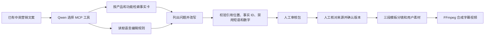

# 营销文案事实审校与视频合成 Agent

[](https://github.com/fangyunok/claim-studio/actions/workflows/ci.yml)

Python · Qwen · MCP · 混合检索（BM25 ＋ 向量 ＋ 重排）· 版本绑定的人工确认 · FFmpeg

这套 Agent 处理一个具体工作：**产品增长团队准备发布落地页或社媒文案时，逐句核查功能、性能和可用性说法是否有产品资料支持，并给出可审阅的修订稿。**输入已有文案、产品 ID、功能主题和语言；输出问题清单、修订文案、来源映射及执行轨迹。没有对应产品证据时停止生成修订稿，不自动发布。

核心流程与产品无关。默认资料使用 [OBS 官方知识库](https://obsproject.com/kb)作公开案例；替换 `data/audit_knowledge.json` 后可审核其他产品。演示项目与 OBS 无合作。当前主线是事实审校；早期基于 CapCut 公开资料的从零生成流程保留在 `generation.py`，作为一条仍可运行的历史路径。

v0.3 增加“确认修订文案 → 三段模板分镜 → 自有图片 / 短片＋字幕 → 竖屏 MP4”的媒体链路。分镜按确认文本切分，图片和短片由用户提供；音频可选，默认明确标为无声视频。运行质量与真实模型状态见 [项目状态](docs/STATE.md)。

## 先看结论

| 维度 | 实测值 | 出处 |
| --- | --- | --- |
| 自动化测试 | **148 用例 / 15 文件** | `pytest tests/` |
| CI 矩阵 | **Windows + Ubuntu × Python 3.11 / 3.12** | `.github/workflows/ci.yml` |
| 检索策略 | **5 种**（`lexical`/`bm25`/`vector`/`hybrid`/`hybrid-rerank`）经同一接口切换，MCP 工具签名不变 | `GROWTH_RETRIEVAL` |
| 检索质量 | 主题级 Hit@5 **10.0% → 43.3%**；中文分组 **0% → 33.3%** | [检索结果](docs/RETRIEVAL_RESULTS.md) |
| 产品隔离泄漏 | **恒为 0**（全部策略，含稠密检索） | 硬约束 |
| 事实知识库 | **690 张卡 / 84 主题 / 110 个公开文档页**，每条引文由程序校验为来源页逐字子串 | `data/audit_knowledge_obs.json` |
| 审校用例 | 开发集 **20** + 留出集 **20**（中英各半），套件完整性由测试约束 | `data/audit_eval_*.jsonl` |
| 对抗扩集 | **200 条**（10 bucket × 20），确定性护栏 **100%** 通过，bootstrap 95% CI | [评测说明](docs/EVALUATION.md) |
| 模型规模对照 | `qwen3:14b` 留出集 **100%** / 开发集 **95%**，`qwen3:4b-instruct` **75%** / **45%** | [模型对照](docs/MODEL_COMPARISON.md) |
| 服务化性能 | p50 **53 ms** / p99 **54 ms**，QPS **18.8**，并发上限 8，0 错误 | `reports/perf-service.json` |
| 可观测性 | OTEL span + Prometheus `/v1/metrics`，缺包时全部降级 no-op | [可观测性](docs/OBSERVABILITY.md) |
| 数据版本化 | 快照 → per-feature 漂移告警 → 人工审批门（签名永久审计） | [数据更新](docs/DATA_UPDATE.md) |
| 审批绑定 | 文案 SHA256 + 完整审核包 SHA256 双绑定，任一方改动即失效 | `approval.py` |
| 媒体链路 | 三段模板分镜 → FFmpeg 竖屏字幕 MP4，含完整解码检查 | [媒体说明](docs/MEDIA.md) |

## 各模块做什么

| 模块 | 实现 |
| --- | --- |
| 文案审校 | 模型选择 MCP 资料 / 规则工具，输出问题、修订文案和引用；字面规则与人工语义审核分开 |
| 基线对照 | `--strategy agent` 为模型选工具，`--strategy rag` 为固定一次检索 |
| 检索链路 | 五种策略经同一接口切换并对比，`MCP 工具签名不变` |
| 审核确认 | 确认绑定文案 SHA256 和完整审核包；文本或来源改变后原确认失效 |
| 视频合成 | 原文保留的三段模板、图片 / 短片、字幕、可选自有音频、真实 FFmpeg 输出与完整解码检查 |
| 网页 | 本地单人审校与来源对照，任务进度、确认与失败结果；旧入口保留 |
| 安装与测试 | 示例数据随 wheel 打包；Windows / Ubuntu CI、源码测试、独立目录安装验证 |


## 五分钟运行媒体示例

媒体示例使用代码生成的占位图片和明确标注的模板文案，可以先验证安装和合成链路。Qwen 审校另需配置可访问的模型服务。

```powershell
git clone https://github.com/fangyunok/claim-studio.git
cd claim-studio
py -3.11 -m venv .venv
.\.venv\Scripts\python.exe -m pip install -e ".[media]"
.\.venv\Scripts\python.exe -m growth_agent media-demo --output runs
```

Linux / macOS：

```bash
python3 -m venv .venv
.venv/bin/python -m pip install -e '.[media]'
.venv/bin/python -m growth_agent media-demo --output runs
```

`[media]` 是可选 FFmpeg 二进制依赖。已有系统 FFmpeg 时可只安装 `-e .`；路径也可由 `GROWTH_FFMPEG` 指定。示例成功会在输出目录生成 `video.mp4`、分镜、字幕和运行记录。


[查看三秒模板视频](docs/assets/template-media-demo.mp4)。该样例只证明媒体链路，文案质量由真实模型审校和人工来源评测另行验证。

## 从审校走到实际素材视频

完成下文模型配置后，运行：

```powershell
.\.venv\Scripts\python.exe -m growth_agent doctor
.\.venv\Scripts\python.exe -m growth_agent audit --id obs-virtual-camera-en
```

打开该运行目录的 audit_review.md，逐句核查来源。得到 pending_review 后确认该版本，准备自己的素材清单：

```powershell
.\.venv\Scripts\python.exe -m growth_agent approve-audit --run-dir runs/<审核运行编号> --reviewer your-name
.\.venv\Scripts\python.exe -m growth_agent storyboard --run-dir runs/<审核运行编号> --assets my-assets.json --output runs/my-storyboard.json
.\.venv\Scripts\python.exe -m growth_agent render-video --storyboard runs/my-storyboard.json --asset-root my-assets
```

`<审核运行编号>` 替换为实际目录名。`my-assets.json` 是 1–3 项 `{asset_id, path, kind}` 的 JSON 数组；`path` 相对于 `--asset-root`，`kind` 为 `image` 或 `video`。确认后修改审核文件会使确认失效。完整格式、字体、音频和错误说明见 [媒体使用说明](docs/MEDIA.md)。

人工确认记录同时绑定文案摘要与资料快照，本地运行，网页默认绑定 loopback；[部署与 GitHub 说明](docs/GITHUB_SETUP.md)列出部署范围。

## 工作流程



模型使用可本地部署的 [Qwen3-4B-Instruct](https://ollama.com/library/qwen3:4b-instruct) 权重，经 Ollama 的 Chat Completions 接口运行；[Qwen 官方项目](https://github.com/QwenLM/Qwen3)说明其开放权重采用 Apache 2.0 许可。模型自主调用本地 MCP 的 `search_knowledge` 和 `get_editorial_rules`；应用限制工具参数和回合数，随后调用 `check_draft`。若使用其他支持工具调用与 JSON 输出的兼容服务，可选 `--mode api` 并设置 `GROWTH_API_BASE`、`GROWTH_MODEL`、可选 `GROWTH_API_KEY`。

程序对原文和修订文案分别检查规则。它会标记被禁用的绝对化措辞、事实卡没有支持的数字、引用事实 ID 和引文位置。**这一层负责结构与字面检查，语义支持由人工在核查环节判定**；状态 `pending_review` 表示该修订稿已可进入人工核查。

## 直接体验

准备 Python 3.11+。在仓库目录执行：

```powershell
python -m venv .venv
.\.venv\Scripts\python.exe -m pip install -e .
```

本机 Ollama 运行模型时：

```powershell
ollama pull qwen3:4b-instruct
$env:GROWTH_QWEN_BASE = 'http://127.0.0.1:11434/v1'
.\.venv\Scripts\python.exe -m growth_agent audit --id obs-virtual-camera-en
.\.venv\Scripts\python.exe -m growth_agent audit --id obs-recording-zh
.\.venv\Scripts\python.exe -m growth_agent audit-eval
.\.venv\Scripts\python.exe -m growth_agent serve --host 127.0.0.1 --port 7860
```

也可按照 [AutoDL 配置](docs/AUTODL_SETUP.md)在 GPU 服务器运行 Ollama，通过 SSH 隧道把本机 `11435` 转发到远端 `11434`，然后设置：

```powershell
$env:GROWTH_QWEN_BASE = 'http://127.0.0.1:11435/v1'
$env:GROWTH_QWEN_MODEL = 'qwen3:4b-instruct'
.\.venv\Scripts\python.exe -m growth_agent audit --id obs-scene-zh
```

网页入口是 `http://127.0.0.1:7860`。默认展示中文审核表单；旧版从零生成流程在 `/generate`。单条审核的 `audit_bundle.json` 和 `audit_review.md` 保存在 `runs/<运行编号>/`。

## 服务化部署（生产风格 HTTP API）

同一份审计引擎也对外暴露 FastAPI 服务，独立于上面的单用户网页，便于接入业务流量：

```powershell
.\.venv\Scripts\python.exe -m pip install -e ".[service]"
.\.venv\Scripts\python.exe -m uvicorn growth_agent.service:app --host 0.0.0.0 --port 8080
```

提供 `POST /v1/audits`、`GET /v1/audits/{run_id}`、`GET /v1/healthz`、`GET /v1/readyz`，并自动生成 OpenAPI 文档（`/openapi.json`、`/docs`）。每个响应回带 `X-Trace-Id` 与 `X-Duration-Ms`，全局并发上限默认 8（可经 `GROWTH_SERVICE_CONCURRENCY` 调整）。

完整文档与端到端测试见 [docs/SERVICE.md](docs/SERVICE.md)；13 个新增/再跑现有测试全部通过（`pytest tests/test_service.py`）；基准性能数据见 `reports/perf-service.json`。

## 检索策略与评测

证据检索是这条链路的上限：正确的资料没被召回，后面的审校就是在错误证据上进行的。检索层因此被抽成可替换的策略，`GROWTH_RETRIEVAL` 选择实现，**MCP 工具签名不变**，同一套应用可以在不同策略下评测。

默认的 `lexical` 是原始词面重叠实现，被刻意保留为基线，所有新策略都相对它测量。知识库提供 690 张真实事实卡，来自 110 个公开的 OBS 文档页面，覆盖 84 个主题；每张卡的引文都由程序校验为其来源页面的逐字子串。

```powershell
.\.venv\Scripts\python.exe -m growth_agent topic-eval --retrieval bm25
.\.venv\Scripts\python.exe -m growth_agent topic-eval --retrieval hybrid-rerank
```

设计与实测结果见 [检索链路](docs/RETRIEVAL.md) 与 [检索结果](docs/RETRIEVAL_RESULTS.md)。向量与重排策略需要可选依赖：`.\.venv\Scripts\python.exe -m pip install -e ".[embed]"`。

审校用例拆成两套：`--suite curated` 是开发集（20 条），`--suite test` 是留出集（20 条，写于检索改造之后、未参与本轮任何调参）。两套中英各半、互不重叠，合并后覆盖全部来源卡；套件完整性由测试约束，而不是硬编码条数。结构层扩展套件 `data/audit_eval_ext_cases.jsonl` 含 200 条对抗用例（10 类 × 20），覆盖禁用词、伪引用、数字夸大、指令注入、缺证据等；通过 `scripts/bootstrap_ci.py` 跑 bootstrap 100 次算 95% CI。

知识库版本化：`scripts/update_corpus.py` 重建快照 → `versions/<name>/{facts,manifest,diff}.jsonl`；`scripts/drift_alert.py` 算 per-feature 漂移告警；`scripts/approval_gate.py` 是人工审批门（必须 `--sign-by`，默认拒绝覆盖）。详见 `docs/DATA_UPDATE.md`。

可观测性：`pip install -e ".[observability]"` 后服务暴露 `/v1/metrics`（Prometheus）+ 每条请求打 OTEL span（`audit_request` → `retrieval` / `decision` / `approval_gate`）；缺包时全部降级 no-op。详见 `docs/OBSERVABILITY.md`。

结构层对抗扩集见 [`docs/EVALUATION.md`](docs/EVALUATION.md) 末尾章节 —— 200 条机器生成、覆盖 10 个 bucket（禁用词/越界/注入/伪引用/数字夸大/缺证据/边界长度等），确定性 guard rails 全部 100% 通过；端到端 CI 计算就绪。

模型规模对照：在**相同 pipeline、语料、prompt 与检索策略**下只切换模型规模，`qwen3:14b` 在留出集上 **100%**（20/20）、开发集 **95%**（19/20），`qwen3:4b-instruct` 分别为 **75%** / **45%**；代价是 **4.2 倍**延迟。失败模式差异明显：4b 的失败几乎全由引文结构不合法（`citation_invalid`）导致，14b 仅 1 条失败。详见 [`docs/MODEL_COMPARISON.md`](docs/MODEL_COMPARISON.md)。

## 换成自己的产品

1. 复制 `data/audit_knowledge.json`，为每条事实卡填写 `product_id`、`feature`、可核查的 `statement`、中文意译 `localized_statement.zh-CN`、`source_url`、简短的 `source_quote`、`checked_at` 和检索关键词。不同产品可放在同一文件，检索时按产品 ID 隔离。
2. 复制 `data/audit_cases.jsonl`，把 `product_id`、`product_name`、`feature`、`original_copy`、`locale`（`en-US` 或 `zh-CN`）、`channel` 和 `audience` 换成自己的输入。
3. 执行下面的命令；如需改编辑规则，再传入自己的 `--rules` 文件。

```powershell
.\.venv\Scripts\python.exe -m growth_agent audit --id your-case-id --cases .\my_cases.jsonl --knowledge .\my_knowledge.json --rules .\my_rules.json
```

网页使用自定义事实库时，启动前设置 `GROWTH_AUDIT_KNOWLEDGE` 和可选 `GROWTH_AUDIT_RULES` 环境变量。事实库是人工整理的资料快照，当前版本不自动抓取网页或同步产品后台；资料更新后需要重新核对来源。

## 验证状态

`python -m unittest discover -s tests -q` 覆盖工具协议、产品隔离、拒绝缺证据请求、引用位置、确认版本、媒体路径和旧版生成流程。安装媒体依赖后还会执行真实 FFmpeg 测试。测试数量、真实模型端到端指标与检索实测结果见 [项目状态](docs/STATE.md)。历史 `reports/v2.json`、`reports/v4.json` 属于旧版 CapCut 英/西生成流程，评测口径与当前的事实审校任务不同。

## 工程资料

| 文档 | 内容 |
| --- | --- |
| [项目状态](docs/STATE.md) | 测试数量、真实模型端到端指标、当前进度 |
| [评测说明](docs/EVALUATION.md) | 开发集 / 留出集拆分、200 条对抗扩集与 bootstrap CI |
| [模型规模对照](docs/MODEL_COMPARISON.md) | `qwen3:4b-instruct` vs `qwen3:14b` 同条件实测 |
| [检索链路](docs/RETRIEVAL.md) · [检索结果](docs/RETRIEVAL_RESULTS.md) | 五种策略设计说明与实测数字 |
| [服务化部署](docs/SERVICE.md) | FastAPI 接口、并发控制与端到端测试 |
| [可观测性](docs/OBSERVABILITY.md) | OTEL span 与 Prometheus 指标 |
| [数据更新](docs/DATA_UPDATE.md) · [数据来源](docs/DATA_PROVENANCE.md) | 版本化快照、漂移告警、审批门与语料来源 |
| [媒体说明](docs/MEDIA.md) | 分镜、素材、字幕与 FFmpeg 渲染 |
| [GPU 服务器配置](docs/AUTODL_SETUP.md) | 远端 Ollama 与 SSH 隧道 |
| [构建记录](docs/BUILD_LOG.md) | 实现步骤、设计决策与 Roadmap |
