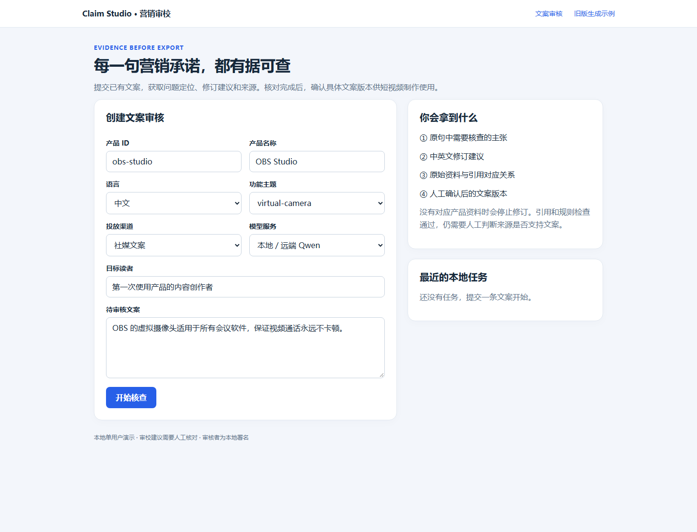
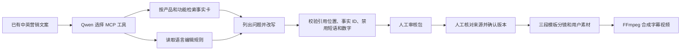

# 营销文案事实审校与视频合成 Agent

[](https://github.com/fangyunok/claim-studio/actions/workflows/ci.yml)

Python · Qwen · MCP · 检索增强审校 · 版本绑定的人工确认 · FFmpeg

这套 Agent 处理一个具体工作：**产品增长团队准备发布落地页或社媒文案时，逐句核查功能、性能和可用性说法是否有产品资料支持，并给出可审阅的修订稿。**输入已有文案、产品 ID、功能主题和语言；输出问题清单、修订文案、来源映射及执行轨迹。没有对应产品证据时停止生成修订稿，不自动发布。

核心流程与产品无关。默认资料使用 [OBS 官方知识库](https://obsproject.com/kb)作公开案例；替换 `data/audit_knowledge.json` 后可审核其他产品。演示项目与 OBS 无合作。仓库早期版本基于 CapCut 公开资料的从零生成流程仍可运行并保留在 `generation.py`，但不是本项目的主入口。

v0.3 增加“确认修订文案 → 三段模板分镜 → 自有图片 / 短片＋字幕 → 竖屏 MP4”的媒体链路。分镜按确认文本切分，图片和短片由用户提供；音频可选，默认明确标为无声视频。运行质量与真实模型状态见 [项目状态](docs/STATE.md)。

## GitHub 上可以复现什么

| 能力 | 当前实现 |
| --- | --- |
| 文案审校 | 模型选择 MCP 资料 / 规则工具，输出问题、修订文案和引用；字面规则与人工语义审核分开 |
| 基线对照 | `--strategy agent` 为模型选工具，`--strategy rag` 为固定一次检索 |
| 审核确认 | 确认绑定文案 SHA256 和完整审核包；文本或来源改变后原确认失效 |
| 视频合成 | 原文保留的三段模板、图片 / 短片、字幕、可选自有音频、真实 FFmpeg 输出与完整解码检查 |
| 网页 | 本地单人审校与来源对照，任务进度、确认与失败结果；旧入口保留 |
| 安装与测试 | 示例数据随 wheel 打包；Windows / Ubuntu CI、源码测试、独立目录安装验证 |



## 五分钟运行媒体示例

媒体示例使用代码生成的占位图片和明确标注的模板文案，可以先验证安装和合成链路。Qwen 审校另需配置可访问的模型服务。

```powershell
git clone https://github.com/fangyunok/claim-studio.git
cd claim-studio
py -3.11 -m venv .venv
.\.venv\Scripts\python.exe -m pip install -e ".[media]"
.\.venv\Scripts\python.exe -m growth_agent media-demo --output runs
```

Linux / macOS：

```bash
python3 -m venv .venv
.venv/bin/python -m pip install -e '.[media]'
.venv/bin/python -m growth_agent media-demo --output runs
```

`[media]` 是可选 FFmpeg 二进制依赖。已有系统 FFmpeg 时可只安装 `-e .`；路径也可由 `GROWTH_FFMPEG` 指定。示例成功会在输出目录生成 `video.mp4`、分镜、字幕和运行记录。


[查看三秒模板视频](docs/assets/template-media-demo.mp4)。该样例只证明媒体链路，文案质量由真实模型审校和人工来源评测另行验证。

## 从审校走到实际素材视频

完成下文模型配置后，运行：

```powershell
.\.venv\Scripts\python.exe -m growth_agent doctor
.\.venv\Scripts\python.exe -m growth_agent audit --id obs-virtual-camera-en
```

打开该运行目录的 audit_review.md，逐句核查来源。得到 pending_review 后确认该版本，准备自己的素材清单：

```powershell
.\.venv\Scripts\python.exe -m growth_agent approve-audit --run-dir runs/<审核运行编号> --reviewer your-name
.\.venv\Scripts\python.exe -m growth_agent storyboard --run-dir runs/<审核运行编号> --assets my-assets.json --output runs/my-storyboard.json
.\.venv\Scripts\python.exe -m growth_agent render-video --storyboard runs/my-storyboard.json --asset-root my-assets
```

`<审核运行编号>` 替换为实际目录名。`my-assets.json` 是 1–3 项 `{asset_id, path, kind}` 的 JSON 数组；`path` 相对于 `--asset-root`，`kind` 为 `image` 或 `video`。确认后修改审核文件会使确认失效。完整格式、字体、音频和错误说明见 [媒体使用说明](docs/MEDIA.md)。

人工确认记录用于本地演示，没有企业账号认证能力。网页默认绑定 loopback；[部署与 GitHub 说明](docs/GITHUB_SETUP.md)列出当前演示范围。

## 工作流程



模型使用可本地部署的 [Qwen3-4B-Instruct](https://ollama.com/library/qwen3:4b-instruct) 权重，经 Ollama 的 Chat Completions 接口运行；[Qwen 官方项目](https://github.com/QwenLM/Qwen3)说明其开放权重采用 Apache 2.0 许可。模型自主调用本地 MCP 的 `search_knowledge` 和 `get_editorial_rules`；应用限制工具参数和回合数，随后调用 `check_draft`。若使用其他支持工具调用与 JSON 输出的兼容服务，可选 `--mode api` 并设置 `GROWTH_API_BASE`、`GROWTH_MODEL`、可选 `GROWTH_API_KEY`。

程序对原文和修订文案分别检查规则。它会标记被禁用的绝对化措辞、事实卡没有支持的数字、引用事实 ID 和引文位置。**这些是确定性护栏，无法判断来源是否在语义上真正支持一句话**；状态 `pending_review` 只表示可以进入人工核查。

## 直接体验

准备 Python 3.11+。在仓库目录执行：

```powershell
python -m venv .venv
.\.venv\Scripts\python.exe -m pip install -e .
```

本机 Ollama 运行模型时：

```powershell
ollama pull qwen3:4b-instruct
$env:GROWTH_QWEN_BASE = 'http://127.0.0.1:11434/v1'
.\.venv\Scripts\python.exe -m growth_agent audit --id obs-virtual-camera-en
.\.venv\Scripts\python.exe -m growth_agent audit --id obs-recording-zh
.\.venv\Scripts\python.exe -m growth_agent audit-eval
.\.venv\Scripts\python.exe -m growth_agent serve --host 127.0.0.1 --port 7860
```

也可按照 [AutoDL 配置](docs/AUTODL_SETUP.md)在 GPU 服务器运行 Ollama，通过 SSH 隧道把本机 `11435` 转发到远端 `11434`，然后设置：

```powershell
$env:GROWTH_QWEN_BASE = 'http://127.0.0.1:11435/v1'
$env:GROWTH_QWEN_MODEL = 'qwen3:4b-instruct'
.\.venv\Scripts\python.exe -m growth_agent audit --id obs-scene-zh
```

网页入口是 `http://127.0.0.1:7860`。默认展示中文审核表单；旧版从零生成流程在 `/generate`。单条审核的 `audit_bundle.json` 和 `audit_review.md` 保存在 `runs/<运行编号>/`。

## 换成自己的产品

1. 复制 `data/audit_knowledge.json`，为每条事实卡填写 `product_id`、`feature`、可核查的 `statement`、中文意译 `localized_statement.zh-CN`、`source_url`、简短的 `source_quote`、`checked_at` 和检索关键词。不同产品可放在同一文件，检索时按产品 ID 隔离。
2. 复制 `data/audit_cases.jsonl`，把 `product_id`、`product_name`、`feature`、`original_copy`、`locale`（`en-US` 或 `zh-CN`）、`channel` 和 `audience` 换成自己的输入。
3. 执行下面的命令；如需改编辑规则，再传入自己的 `--rules` 文件。

```powershell
.\.venv\Scripts\python.exe -m growth_agent audit --id your-case-id --cases .\my_cases.jsonl --knowledge .\my_knowledge.json --rules .\my_rules.json
```

网页使用自定义事实库时，启动前设置 `GROWTH_AUDIT_KNOWLEDGE` 和可选 `GROWTH_AUDIT_RULES` 环境变量。事实库是人工整理的资料快照，当前版本不自动抓取网页或同步产品后台；资料更新后需要重新核对来源。

## 验证状态

`python -m unittest discover -s tests -q` 覆盖工具协议、产品隔离、拒绝缺证据请求、引用位置、确认版本、媒体路径和旧版生成流程。安装媒体依赖后还会执行真实 FFmpeg 测试。最新测试数量与真实模型端到端结果以 [项目状态](docs/STATE.md)记录为准。历史 `reports/v2.json`、`reports/v4.json` 属于旧版 CapCut 英/西生成流程，**不能用作新版审校 Agent 的效果指标**。
